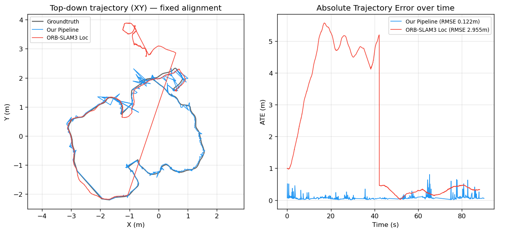
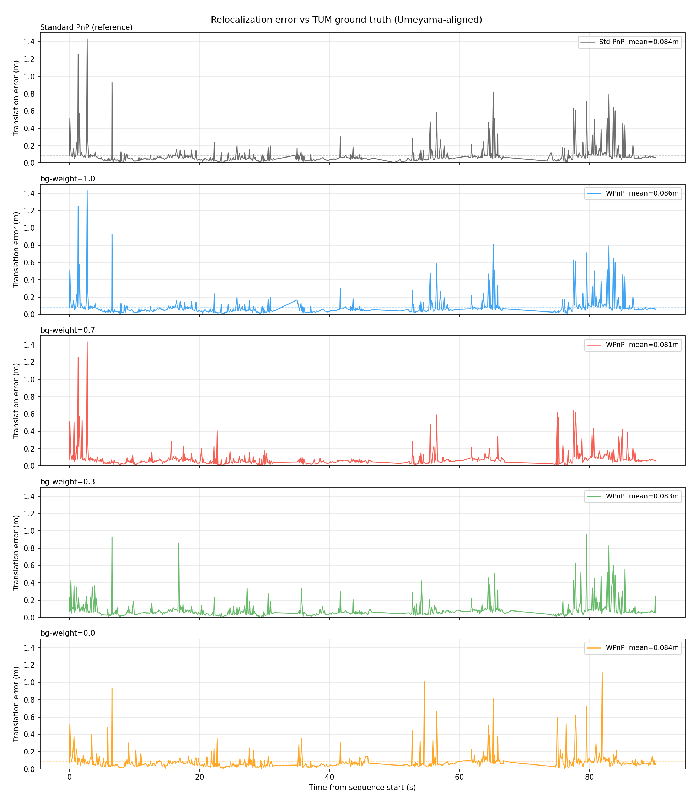

# Indoor Robot Navigation with Semantic-Weighted Relocalization

[](https://docs.ros.org/en/humble/)
[](https://isocpp.org/)
[](https://www.python.org/)
[](https://docs.ultralytics.com/)
[](https://github.com/UZ-SLAMLab/ORB_SLAM3)

> **Undergraduate Thesis Project** — Institut Teknologi Sepuluh Nopember (ITS), 2025  
> *Indoor Robot Navigation System with Relocalization Based on Semantic-Weighted Pose Estimation Using ORB-SLAM3 and YOLOv8*

---

## Overview

This project implements a complete indoor robot navigation system that combines visual SLAM-based relocalization with semantic object detection. The core contribution is a **custom relocalization pipeline** that replaces ORB-SLAM3's native pose estimation with a semantic-weighted Levenberg–Marquardt optimizer on SE(3): keypoints falling inside YOLO-detected door regions are assigned higher trust weights, while background keypoints are suppressed. The result is a more robust pose estimate under challenging indoor conditions.

On top of relocalization, the system integrates an **A\* path planner** operating over an occupancy grid map, forming a full navigation stack within a ROS2 Humble workspace.

**Key contributions:**
- Semantic-weighted PnP pose estimation using per-keypoint weights derived from YOLOv8 bounding boxes
- Custom Levenberg–Marquardt optimizer on SE(3) via Sophus (no dependency on g2o)
- Side-by-side logging of weighted vs. standard PnP for direct comparison
- Full ROS2 integration: relocalization pose → A\* planner → navigation UI

---

## System Architecture

The system consists of three ROS2 packages:

| Package | Language | Role |
|---|---|---|
| `orb_slam3_relocalization` | C++ | Map creation & visual relocalization |
| `yolo_bbox` | Python | Camera publishing + YOLOv8 landmark detection |
| `navigation` | Python | A\* path planning over an occupancy grid |

**ROS2 Node Graph (relocalization pipeline):**

```
camera_node ──/camera/image_raw──► yolo_bbox_node ──yolo/results──►
                                                                     relocalization_node ──/relocalization/pose──► navigation_node
camera_node ──/camera/image_raw─────────────────────────────────────►
```

- **`camera_node`** — reads a video file or webcam, resizes to 640×480, publishes `sensor_msgs/Image` on `/camera/image_raw`
- **`yolo_bbox_node`** — subscribes to `/camera/image_raw`, runs YOLOv8 inference (background thread with single-slot queue to drop stale frames), publishes detection JSON to `yolo/results`
- **`relocalization_node`** — subscribes to both topics, extracts ORB features, applies semantic weights from YOLO bounding boxes, runs the weighted PnP solver, and publishes `geometry_msgs/Pose` on `/relocalization/pose`
- **`navigation_node`** — subscribes to the pose and an occupancy grid, runs A\* replanning when the robot deviates >25 px from the planned path, publishes the smooth path and visualization images

For a detailed technical description of the weighted PnP algorithm, see [`docs/weighted_pose_estimation.tex`](docs/weighted_pose_estimation.tex).

---

## Results

### Navigation Demo

The following demo shows the full pipeline running in the ITS campus indoor environment: the robot is placed in the environment, the relocalization node estimates its pose against a pre-built map, and the navigation node plans an A\* path to the selected goal.

[](https://youtu.be/pI1m9O_bmqI)

---

### Benchmark 1 — Custom Pipeline vs. ORB-SLAM3 Native Relocalization

The custom pipeline is compared against ORB-SLAM3's native relocalization procedure on the [TUM RGB-D dataset](https://cvg.cit.tum.de/data/datasets/rgbd-dataset). Both pipelines share the same ORB-SLAM3 data structures (Atlas, KeyFrameDatabase, ORBVocabulary, MapPoints); the difference lies in matching strategy, PnP solver, and optimization backend.

| Component | ORB-SLAM3 Native | Custom Pipeline |
|---|---|---|
| Descriptor Matching | BoW-accelerated `SearchByBoW` | Brute-force Hamming distance |
| Initial PnP Solver | MLPnP + RANSAC | EPnP (OpenCV) + RANSAC |
| Optimization | g2o Bundle Adjustment (Huber loss) | Custom LM on SE(3) — Sophus (semantic weights) |
| Guided Refinement | `SearchByProjection` → re-optimize | Single-pass only |
| Semantic Weighting | ✗ | ✓ (door=1.0, other=0.7, background=0.3) |

📊 [**View Pipeline Benchmark Results**]


---

### Benchmark 2 — Weighted PnP vs. Standard PnP (Pose Estimation)

Within the custom pipeline, the semantic-weighted PnP is compared directly against the standard unweighted PnP across different weight configurations, evaluated on TUM RGB-D sequences with ground-truth camera trajectories.



*Translational and rotational error vs. ground-truth poses. Weight configurations: standard (uniform), door=1.0/bg=0.3, door=1.0/bg=0.5, door=1.0/bg=0.7.*

---

## Installation

### Prerequisites

- Ubuntu 22.04
- ROS2 Humble — [installation guide](https://docs.ros.org/en/humble/Installation.html)
- ORB-SLAM3 dependencies: OpenCV 4, Eigen3, Pangolin, DBoW2, g2o
- Python packages: `ultralytics`, `opencv-python`, `numpy`

### 1. Install ORB-SLAM3

Clone and build ORB-SLAM3 into `~/Documents/ORB_SLAM3`:

```bash
cd ~/Documents
git clone https://github.com/UZ-SLAMLab/ORB_SLAM3.git
cd ORB_SLAM3
chmod +x build.sh
./build.sh
```

### 2. Clone This Workspace

```bash
cd ~/Documents
git clone git@github.com:yahyasetz11/ORB_SLAM3_Relocalization.git
cd ORB_SLAM3_Relocalization
```

> **Note:** `CMakeLists.txt` hardcodes the sibling path `~/Documents/ORB_SLAM3`. Both repositories must sit side-by-side under `~/Documents/`.

### 3. Install Python Dependencies

```bash
pip install ultralytics opencv-python numpy
```

### 4. Build the Workspace

```bash
source /opt/ros/humble/setup.bash
colcon build --symlink-install
source install/setup.bash
```

To build a single package:

```bash
colcon build --symlink-install --packages-select orb_slam3_relocalization
colcon build --symlink-install --packages-select yolo_bbox
colcon build --symlink-install --packages-select navigation
```

---

## Quick Start

> ⚠️ **Source ROS2 in every new terminal:**
> ```bash
> source /opt/ros/humble/setup.bash && source install/setup.bash
> ```

### Datasets & Maps

**Benchmark dataset (TUM RGB-D):**  
Used for quantitative evaluation of pose estimation accuracy. Download from the [TUM RGB-D official page](https://cvg.cit.tum.de/data/datasets/rgbd-dataset/download) and place sequences under `data/`:
```
data/
└── tum/
    └── rgbd_dataset_freiburg3_long_office_household/
        ├── rgb/
        ├── depth/
        └── groundtruth.txt
```

**Custom navigation dataset:**  
Recorded in the ITS campus indoor environment. Download from Google Drive and place under `data/`:  
📁 [**Download Custom Dataset**](https://drive.google.com/drive/folders/1zjGoXU79VsqlGexZvIfX5wWzeykAzRj5?usp=sharing)

```
data/
└── indoor_navigation/
    └── <your video files here>
```

**Pre-built maps:**  
Maps are not included in this repository (binary files, too large for Git). Download the pre-built `.osa` map files and place them under `maps/`:  
📁 [**Download Maps**](https://drive.google.com/drive/folders/1GksP4SG0UDHKPOW049I38LWCe5Q29w8l?usp=sharing)

```
maps/
└── <map_name>        ← no file extension needed
```

---

### Step 1 — Build a New Map (optional, skip if using pre-built maps)

Edit `src/orb_slam3_relocalization/config/map_creator_params.yaml` to set your video path and desired map output name, then:

```bash
# From a video file (default)
ros2 launch orb_slam3_relocalization map_creator.launch.py

# From webcam — press Ctrl+C to stop and save
ros2 launch orb_slam3_relocalization map_creator.launch.py mode:=stream
```

---

### Step 2 — Run Relocalization

Edit `src/orb_slam3_relocalization/config/relocalization_params.yaml` to point to your map and video/camera source, then:

```bash
# Video mode (default — reads from relocalization_params.yaml)
ros2 launch orb_slam3_relocalization relocalization.launch.py

# Webcam mode
ros2 launch orb_slam3_relocalization relocalization.launch.py mode:=stream
```

The node publishes the estimated camera pose on `/relocalization/pose` and logs a `comparison_log.csv` file containing side-by-side results from the standard PnP and the weighted PnP for every frame.

---

### Step 3 — Run Navigation

```bash
ros2 launch navigation nav.launch.py
```

The navigation node subscribes to `/relocalization/pose` and the occupancy grid, plans an A\* path to the selected goal, and republans automatically if the robot deviates from the planned path.

---

### Standalone (non-ROS) Executables

```bash
# Run relocalization on a video
./build/orb_slam3_relocalization/relocalization <ORBvoc.txt> <config.yaml> <video.mp4>

# Run relocalization from webcam
./build/orb_slam3_relocalization/relocalization <ORBvoc.txt> <config.yaml> --webcam [device_id]

# Run SLAM (map building) on a video
./build/orb_slam3_relocalization/main_mp4_mono <ORBvoc.txt> <config.yaml> <video.mp4>

# Run SLAM from webcam
./build/orb_slam3_relocalization/slam_webcam_simple <ORBvoc.txt> <config.yaml>

# Verify a map file loads correctly
./build/orb_slam3_relocalization/test_map
```

---

## Configuration

Key parameters for tuning the system:

| Parameter | Location | Effect |
|---|---|---|
| `System.LoadAtlasFromFile` | camera YAML | Map to load for relocalization |
| `System.SaveAtlasToFile` | camera YAML | Map output path during SLAM |
| `Relocalization.BowSimilarityThreshold` | camera YAML | Lower = more keyframe candidates retrieved |
| `Relocalization.MinInliers` | camera YAML | Minimum PnP inliers to accept a pose |
| `Map.ZoomScale`, `Map.OffsetX/Y` | camera YAML | Top-down map visualization tuning |
| `device` | `yolo_bbox_params.yaml` | `cuda` or `cpu` (auto-falls back to cpu) |
| `conf` | `yolo_bbox_params.yaml` | YOLO confidence threshold |

Camera intrinsics are stored in YAML config files under `src/orb_slam3_relocalization/config/`. The `tum_fr3.yaml` config is calibrated for TUM FR3 sequences (640×480). For a custom camera, run `calibration/calibrate_camera.py` with a checkerboard video and copy the resulting intrinsics into a new config file.

---

## Repository Structure

```
ORB_SLAM3_Relocalization/
├── src/
│   ├── orb_slam3_relocalization/   # C++ — core relocalization pipeline
│   │   ├── src/                    # relocalization.cpp, weighted PnP, LM optimizer
│   │   ├── config/                 # YAML configs and camera calibration files
│   │   └── launch/
│   ├── yolo_bbox/                  # Python — camera node + YOLOv8 inference
│   │   └── yolo_bbox/
│   │       └── yolo_bbox_video.py
│   └── navigation/                 # Python — A* planner + navigation UI
│       └── navigation/
│           ├── planner/            # a_star.py, planner base class
│           └── ui/                 # map_ui_node.py
├── docs/                           # Technical write-ups (weighted PnP derivation)
├── media/                          # Result figures and benchmark plots
├── maps/                           # Pre-built .osa map files (gitignored — see Drive link)
├── data/                           # Datasets (gitignored — see Drive links)
```

---

## Citation

If you use this work, please cite:

```
Setiawan, Y. (2025). Indoor Robot Navigation System with Relocalization Based on
Semantic-Weighted Pose Estimation Using ORB-SLAM3 and YOLOv8.
Undergraduate Thesis, Institut Teknologi Sepuluh Nopember.
```

---

## Acknowledgements

- [ORB-SLAM3](https://github.com/UZ-SLAMLab/ORB_SLAM3) — Campos et al., 2021
- [Ultralytics YOLOv8](https://github.com/ultralytics/ultralytics)
- [Sophus](https://github.com/strasdat/Sophus) — SE(3) Lie group library
- [TUM RGB-D Dataset](https://cvg.cit.tum.de/data/datasets/rgbd-dataset) — Sturm et al., 2012